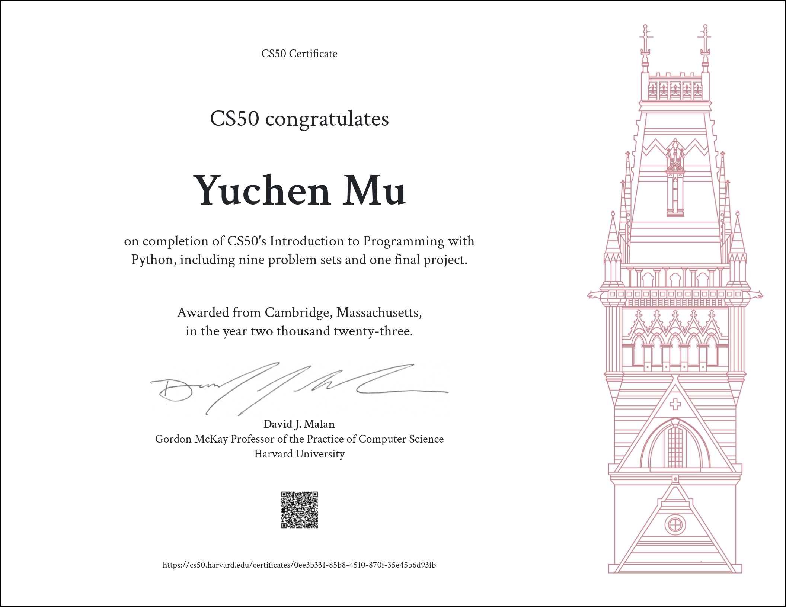

# CS50P
CS50P

# ABOUT THE CLASS
This course is really basic and suitable for beginners. The teacher's instruction is very detailed. This course basically introduces the basic operations of PYTHON, and some exercises are challenging and worth thinking about. Of course, if you have a certain foundation, you may consider writing more elegant and efficient code.
